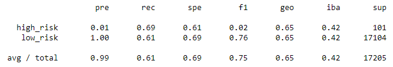
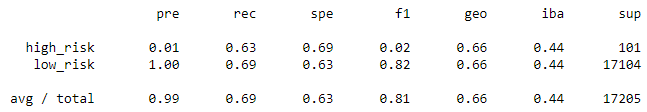
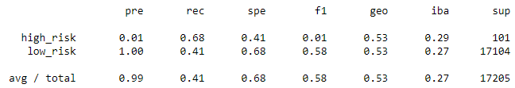
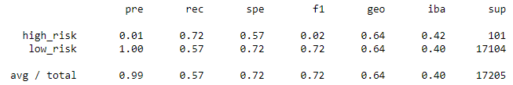

# Module 17 Challenge - Supervised Machine Learning & Credit Risk

## Challenge Overview

The goals of this challenge are for you to:

- Implement machine learning models.
- Use resampling to attempt to address class imbalance.
- Evaluate the performance of machine learning models.

## Resources

Data Sources: [LoanStats_2019Q1](Module-17-Challenge-Resources/LoanStats_2019Q1.csv)

Software: Python (libraries: pandas, numpy, pathlib, collections, sklearn, and imblearn), Juptyer Notebook

## Analysis

### Naive Random Sampling

**Balanced Accuracy Score =** 0.65

**Classification Report**

**Precision Score =**

**Recall Score =**

### SMOTE Oversampling

**Balanced Accuracy Score =** 0.66

**Classification Report**

**Precision Score =**

**Recall Score =**

### Undersampling

**Balanced Accuracy Score =** 0.66

**Classification Report**

**Precision Score =**

**Recall Score =**

### Combination Sampling

**Balanced Accuracy Score =** 0.55

**Classification Report**

**Precision Score =**

**Recall Score =**

### Conclusion

## Report completed by:

